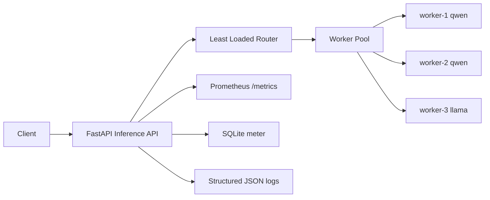

# NeoCloudz Local Inference Platform

A small, local AI inference serving platform built to mimic the request path in the take-home assessment:

Client -> Inference API -> Request Router -> Worker Pool -> Metrics and Usage Metering

This implementation intentionally avoids real GPUs and external paid APIs. It is designed to be easy to understand, debug, and extend during a live interview.

## Requirement compliance checklist

| Requirement | Component / file |
|---|---|
| Inference API: POST /v1/chat/completions, GET /health, GET /ready, GET /workers, GET /metrics | `app/api/routes.py`, `app/main.py` |
| Input validation with Pydantic | `app/models/schemas.py` |
| Worker pool with qwen + llama workers | `app/workers/pool.py`, `app/workers/worker.py` |
| Least-loaded routing logic with deterministic tie-break | `app/routing/router.py` |
| Reliability and failure behaviors | `app/workers/pool.py`, `app/api/routes.py` |
| Prometheus metrics and request IDs | `app/observability/metrics.py`, `app/api/routes.py` |
| Structured JSON logs | `app/observability/logging.py` |
| SQLite usage metering | `app/metering/repository.py` |
| Concurrency 8 load utility | `scripts/load_test.py` |
| Automated tests | `tests/test_app.py` |
| Docker and Compose | `Dockerfile`, `docker-compose.yml` |
| Kubernetes manifests | `k8s/*.yaml` |
| Benchmark documentation | `BENCHMARK.md` |
| Production evolution | `INTERVIEW_NOTES.md` |
| Next-step engineering plan | `WHAT_I_WOULD_DO_NEXT.md` |
| Screen-recording walkthrough | `SCREEN_RECORDING_SCRIPT.md` |

## Architecture



## Request lifecycle

1. Client sends POST /v1/chat/completions with model, messages, and max_tokens.
2. FastAPI validates the request body using Pydantic.
3. The router selects the least-loaded healthy worker that serves the requested model.
4. The selected worker simulates inference with a deterministic delay and token generation.
5. Prometheus metrics are incremented and a request ID is attached to the response headers.
6. Usage records are written to SQLite including model, worker, latency, and token counts.

## Repository structure

```text
.
├── app/
│   ├── api/
│   │   └── routes.py
│   ├── config.py
│   ├── main.py
│   ├── metering/
│   │   └── repository.py
│   ├── models/
│   │   └── schemas.py
│   ├── observability/
│   │   ├── logging.py
│   │   └── metrics.py
│   ├── routing/
│   │   └── router.py
│   └── workers/
│       ├── pool.py
│       └── worker.py
├── data/
├── k8s/
│   ├── configmap.yaml
│   ├── deployment.yaml
│   └── service.yaml
├── scripts/
│   └── load_test.py
├── tests/
│   └── test_app.py
├── .dockerignore
├── BENCHMARK.md
├── Dockerfile
├── INTERVIEW_NOTES.md
├── README.md
├── SCREEN_RECORDING_SCRIPT.md
├── WHAT_I_WOULD_DO_NEXT.md
├── docker-compose.yml
├── requirements.txt
└── .gitignore
```

## Quick start

```bash
python -m venv .venv
. .venv/bin/activate  # Linux / macOS
# or .venv\Scripts\activate  # Windows PowerShell
pip install -r requirements.txt
python -m uvicorn app.main:app --host 0.0.0.0 --port 8000
```

Then open:

- http://localhost:8000/health
- http://localhost:8000/ready
- http://localhost:8000/workers
- http://localhost:8000/metrics

## Docker setup

```bash
docker build -t neo-cloudz-inference .
docker run --rm -p 8000:8000 neo-cloudz-inference
```

Or with Compose:

```bash
docker compose up --build
```

## Kubernetes

```bash
kubectl apply -f k8s/configmap.yaml
kubectl apply -f k8s/deployment.yaml
kubectl apply -f k8s/service.yaml
```

These manifests are intentionally simple and demonstrate a local production-shape deployment. They do not pretend to run real NVIDIA workloads. In production, GPU worker pools would use the NVIDIA device plugin or GPU Operator in Kubernetes, and the local simulation would be replaced by vLLM, TGI, or another serving runtime.

## API examples

### Health

```bash
curl http://localhost:8000/health
```

### Ready

```bash
curl http://localhost:8000/ready
```

### Qwen inference

```bash
curl -X POST http://localhost:8000/v1/chat/completions \
  -H 'Content-Type: application/json' \
  -d '{
    "model": "qwen",
    "messages": [{"role": "user", "content": "Explain Kubernetes in simple terms."}],
    "max_tokens": 200
  }'
```

### Llama inference

```bash
curl -X POST http://localhost:8000/v1/chat/completions \
  -H 'Content-Type: application/json' \
  -d '{
    "model": "llama",
    "messages": [{"role": "user", "content": "Explain microservices."}],
    "max_tokens": 200
  }'
```

### Metrics

```bash
curl http://localhost:8000/metrics
```

## Failure simulation

The admin endpoints are unauthenticated development controls and must not be exposed outside a local/demo environment.

### Mark a worker unhealthy

```bash
curl -X POST http://localhost:8000/admin/workers/worker-1/health \
  -H 'Content-Type: application/json' \
  -d '{"healthy": false}'
```

### Force simulated worker failure

```bash
curl -X POST http://localhost:8000/admin/workers/worker-3/mode \
  -H 'Content-Type: application/json' \
  -d '{"mode": "error"}'
```

### Reset all workers

```bash
curl -X POST http://localhost:8000/admin/reset \
  -H 'Content-Type: application/json' \
  -d '{}'
```

## Test commands

```bash
python -m pytest -q
```

## Load test commands

```bash
python scripts/load_test.py --requests 40 --concurrency 8 --max-tokens 200 --model-mix "qwen:80,llama:20"
```

## Local benchmark summary

`BENCHMARK.md` contains the measured local concurrency-8 run. It separates actual latency/throughput numbers, simulated worker behavior, and production estimates.

## Routing strategy

The router is intentionally simple and explicit:

- Filter to workers serving the requested model.
- Exclude unhealthy workers.
- Exclude workers at capacity.
- Rank remaining workers by queue depth + active requests, then utilization, then worker ID.

This is a least-loaded strategy rather than naive round robin. It is easier to explain, easier to debug, and better for heterogeneous local inference workloads with different model-specific latency and queue behavior.

## Reliability behavior

- When one qwen worker is unhealthy, the service continues through the remaining worker.
- When all workers for a requested model are unhealthy, the service returns a clean HTTP 503.
- Retry attempts are bounded by `MAX_RETRIES` to avoid retry storms.
- When all healthy workers for a model are at their active concurrency limit, the service rejects the request with HTTP 429. This implementation does not maintain a waiting queue; `QUEUE_LIMIT` is retained as configuration for the worker model but is not an admission queue.
- Worker failures are recorded in SQLite with zero output tokens and the failure status.

## Observability

Prometheus endpoints expose:

- total requests
- successful requests
- failed requests
- latency histogram
- active requests
- worker health
- queue depth
- worker utilization
- generated tokens

Structured JSON logs include fields such as:

- timestamp
- level
- request_id
- customer
- model
- worker_id
- latency_ms
- status

## SQLite usage metering

Usage metering is stored in `data/usage.db` and keyed by request ID. Each record includes:

- request_id
- customer
- model
- input_tokens
- output_tokens
- total_tokens
- latency_ms
- worker_id
- status
- timestamp

This is intentionally local and easy to inspect during an interview. In production, this would evolve into PostgreSQL or a streaming pipeline that emits usage events into Kafka or another event system.

## Key engineering decisions and tradeoffs

- Simulated GPU utilization is clearly labeled as simulated to avoid claiming real GPU behavior.
- Worker failure modes are explicit and easy to trigger via admin endpoints.
- The router is intentionally simple and deterministic, which makes debugging and live discussion easier.
- SQLite is used locally because it matches the assessment requirement and keeps the platform easy to run without external services.
- No paid APIs or GPU hardware are required.

## Known limitations

- This is a local simulation, not a production inference runtime.
- Queue depth and latency are simulated, not measured from a real model server.
- There is no real GPU scheduling, model registry, or tenant isolation beyond the local app model.
- The design intentionally avoids over-engineering.

## Production evolution

See `INTERVIEW_NOTES.md` for the architecture-level discussion for roughly 1,000 NVIDIA B200/B300 GPUs, multi-cluster routing, GPU scheduling, model lifecycle, and storage and observability design.

## Final verification performed

The project was validated with:

- full pytest suite
- live health / ready checks
- sample qwen request
- worker fallback path
- metrics endpoint
- SQLite usage recording
- concurrency 8 load test

## License

This project is intended for interview assessment use and local demonstration.
